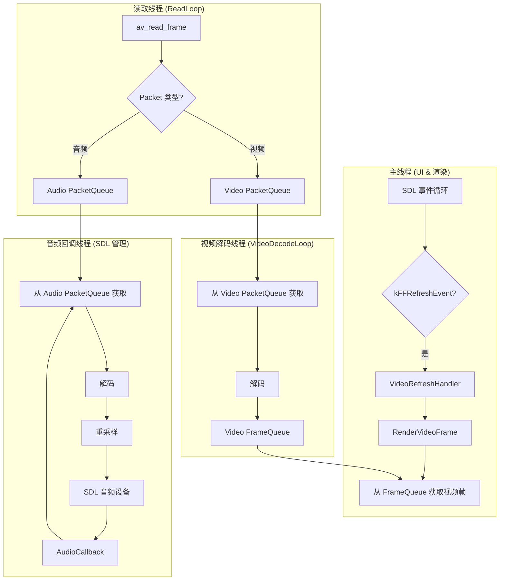

# AVPlayer 项目文档

## 项目概述

`AVPlayer` 是一个基于 FFmpeg (7.1) 和 SDL2 (2.30) 的现代化、轻量级音视频播放器。它使用 C++20 编写，并采用 `xmake` 进行项目构建。该项目的核心目标是展示一个清晰、健壮、易于理解的播放器架构，特别是在多线程处理、资源管理和音视频同步等关键领域，为学习者提供一个高质量的参考实现。

**核心特性:**

* **现代化 C++ 实践:** 全面采用 C++20 特性，特别是通过 `std::unique_ptr` 和自定义删除器实现对 FFmpeg/SDL C 风格资源的 RAII 式管理，以及使用 `std::jthread` 进行线程管理。
* **多线程架构:** 解复用、视频解码、音频解码和渲染分别在独立线程中运行，充分利用多核 CPU 性能，保证 UI 响应的流畅性。
* **精准的音视频同步:** 采用音频时钟作为主时钟的策略，实现了基于动态阈值调整和时钟漂移修正的精确同步逻辑，确保了流畅的播放体验。
* **交互式播放控制**: 支持运行时的播放/暂停切换以及基于时间步长的快进/快退功能。
* **健壮的队列设计:** 实现了两种核心的线程安全队列：`PacketQueue` 用于码流包缓冲，`FrameQueue` 用于解码帧缓冲，它们是整个多线程架构的基石。
* **清晰的模块划分:** 项目代码结构清晰，分为播放器主逻辑 (`Player`)、核心数据结构 (`PacketQueue`, `FrameQueue`) 和日志模块，易于扩展和维护。
* **完善的错误处理**: 采用异常机制处理初始化错误，使用原子变量和条件变量实现优雅的停机机制。
* **智能内存管理**: 通过环形缓冲区和引用计数机制，最大化 AVFrame 复用，减少内存分配开销。
* **高精度同步算法**: 实现了 FFplay 级别的音视频同步算法，包括丢帧策略和时钟漂移修正。

## 核心架构与设计

### 整体架构

`AVPlayer` 采用经典的生产者-消费者模型，并将其扩展到多个线程中，形成了一条清晰的数据处理流水线。



**数据流转路径:**

1.  **读取线程** (`ReadLoop`): 作为唯一的“生产者源头”，负责调用 `av_read_frame()` 从媒体文件中读取 `AVPacket`。然后根据流类型（视频或音频），将 `AVPacket` 分别推入两个不同的 `PacketQueue` 中。
2.  **视频解码线程** (`VideoDecodeLoop`): 作为视频数据的“消费者”和“生产者”，它从视频 `PacketQueue` 中取出 `AVPacket`，解码成 `AVFrame`，然后将解码后的帧放入 `FrameQueue` 中，等待渲染。
3.  **音频处理** (`AudioCallback`): 音频处理由 SDL 的回调机制驱动。当音频设备需要数据时，`AudioCallback` 被触发。它会尝试从音频 `PacketQueue` 中拉取 `AVPacket`，立即解码并重采样，然后将数据直接喂给音频设备。这种“拉”模型确保了音频播放的低延迟。
4.  **主线程** (`main`): 负责 UI 和渲染。它阻塞在 `SDL_WaitEvent()` 上等待事件。一个周期性的 `SDL_Timer` 会推送自定义的 `kFFRefreshEvent` 事件来触发 `VideoRefreshHandler`。`VideoRefreshHandler` 负责执行核心的音视频同步逻辑，并决定何时从 `FrameQueue` 中取出并渲染一帧视频。


### 线程模型详解

  * **主线程**:

      * 职责：初始化 SDL、创建窗口和渲染器、处理用户输入（如暂停/播放、快进/快退、关闭窗口）以及最终的视频帧渲染。
      * 核心循环位于 `main()` 函数中，通过 `SDL_WaitEvent` 驱动，保持了对用户操作的响应性。

  * **读取线程 (`read_thread_`)**:

      * 职责：执行 `Player::ReadLoop`，持续从文件中解复用数据包，直到文件结束。
      * 当文件读取完毕或发生错误时，它会关闭两个 `PacketQueue`，以此作为向后继线程（解码线程）传递“数据流结束”的信号。

  * **视频解码线程 (`video_decode_thread_`)**:

      * 职责：执行 `Player::VideoDecodeLoop`，从 `video_packet_queue_` 中阻塞式地获取数据包进行解码。
      * 解码后的视频帧（包含计算好的 PTS）被放入 `video_frame_queue_`。
      * 当从 `video_packet_queue_` 获取到空指针（队列关闭的信号）后，它会冲刷（flush）解码器内部的缓冲帧，然后关闭 `video_frame_queue_` 并退出线程。

  * **音频回调线程**:

      * 该线程由 `SDL_OpenAudio` 创建并管理，不由我们直接控制。
      * 职责：高优先级地执行 `Player::AudioCallback`。此函数**必须**是非阻塞的，以避免音频卡顿。因此，它使用 `TryPop` 从 `audio_packet_queue_` 非阻塞地获取数据包。

### 音视频同步（AV-Sync）

音视频同步是播放器的灵魂。`AVPlayer` 采用**音频作为主时钟**的策略，因为人耳对音频的卡顿比视频的跳帧更敏感。

1.  **主时钟源**: 音频时钟 `audio_clock_` 是同步的基准。它在 `DecodeAudioFrame` 函数中，根据解码出的音频帧的 PTS 和时长进行更新。

    ```cpp
    // file: player.cpp
    // 在音频解码后更新音频时钟
    if (audio_frame_.get()->pts != AV_NOPTS_VALUE) { //
        AVRational time_base = audio_stream_->time_base; //

        // 计算当前帧的持续时长 (秒) = 样本数 / 采样率
        auto duration = static_cast<double>(audio_frame_.get()->nb_samples) / //
                        audio_frame_.get()->sample_rate; //

        {
            std::lock_guard lk{clock_mtx_}; //
            // 将 pts 转换为秒，然后加上持续时长
            audio_clock_ = audio_frame_.get()->pts * av_q2d(time_base) + duration; //
        }
    }
    ```

2.  **同步执行点**: 同步逻辑在 `VideoRefreshHandler` 中执行，该函数由定时器周期性触发。

3.  **核心同步逻辑**:

      * **计算时钟差**: 计算当前视频帧的显示时间戳 (PTS) 与主时钟 (`audio_clock_`) 的差值 `diff = pts - ref_clock`。
      * **视频过慢 (追赶)**: 如果 `diff` 是一个较大的负数（`diff <= -sync_threshold`），意味着视频远远落后于音频。此时，播放器会**丢弃**当前这帧视频，不进行渲染，并立即调度下一帧的刷新，以快速追赶音频进度。
        ```cpp
        // file: player.cpp
        if (diff <= -sync_threshold) { //
            // 丢帧逻辑
            video_frame_queue_.MoveReadIndex();  // 移动读指针，丢弃当前帧
            ScheduleNextVideoRefresh(0);         // 立即调度下一帧
            return;                              // 直接返回，不渲染
        }
        ```
      * **视频过快 (等待)**: 如果 `diff` 是一个正数（`diff >= sync_threshold`），意味着视频领先于音频。此时，播放器会**增加**下一帧的显示延迟，通常是将理论延迟加倍，以等待音频跟上。
      * **动态阈值**: 同步阈值 `sync_threshold` 并非固定值，而是与帧的理论间隔 `delay` 相关联。这使得低帧率视频有更宽松的同步容忍度，而高帧率视频则更严格，非常智能。

4.  **定时器漂移修正**: 简单地使用 `SDL_AddTimer(delay)` 会因为操作系统调度延迟而产生累计误差。`AVPlayer` 使用 `frame_timer_` 来解决这个问题。它维护一个理想的下一帧显示时刻，每次调度时，都计算 `理想时刻 - 当前时刻` 得到精确的延迟，从而消除了累计误差，保证了视频播放的平滑性。

    ```cpp
    // file: player.cpp
    frame_timer_ += delay; //
    double actual_delay = frame_timer_ - (static_cast<double>(av_gettime()) / 1000000.0); //
    if (actual_delay < 0.010) { //
        actual_delay = 0.010; // 最小延迟，防止忙等
    }
    ScheduleNextVideoRefresh(static_cast<int>(actual_delay * 1000 + 0.5)); //
    ```

## 项目结构

### 目录结构

```
AVPlayer/
├── src/                    # 源代码目录
│   ├── main.cpp           # 程序入口点和事件循环
│   ├── player.cpp         # 播放器核心实现
│   ├── core.cpp           # 队列和数据结构实现
│   └── logger.cpp         # 日志系统实现
├── include/avplayer/      # 头文件目录
│   ├── player.hpp         # 播放器类声明
│   ├── core.hpp           # 核心数据结构和RAII封装
│   └── logger.hpp         # 日志系统接口
├── xmake.lua              # 构建配置文件
└── README.md              # 项目文档
```

### 代码组织

项目采用模块化设计，将功能按职责清晰分离：

- **`main.cpp`**: 程序入口，负责命令行参数解析、日志初始化和主事件循环
- **`player.hpp/cpp`**: 播放器核心类，包含所有播放逻辑和同步算法
- **`core.hpp/cpp`**: 基础数据结构，包括线程安全队列和RAII封装
- **`logger.hpp/cpp`**: 统一的日志接口，基于spdlog实现

## 关键模块与类

### 资源管理 (RAII)

`AVPlayer` 的一大亮点是其优雅的资源管理。所有从 FFmpeg 和 SDL 获取的、需要手动释放的资源（如 `AVFormatContext`, `AVFrame`, `SDL_Window`）都被 `std::unique_ptr`接管，并为其提供了专门的 Deleter 结构体。

**示例：`UniqueAVFormatContext`**

```cpp
// file: core.hpp
struct AVFormatContextDeleter { //
    void operator()(AVFormatContext* p) const { //
        if (p) { //
            avformat_close_input(&p); //
        }
    }
};

using UniqueAVFormatContext = std::unique_ptr<AVFormatContext, AVFormatContextDeleter>; //

// 在 Player 类中使用
UniqueAVFormatContext format_ctx_; //
// 当 format_ctx_ 离开作用域时，AVFormatContextDeleter 会被自动调用，
// 从而安全地释放资源，杜绝了内存泄漏。
```

这种模式贯穿整个项目，是现代 C++ 管理 C 库资源的最佳实践。

**完整的 RAII 封装列表:**

```cpp
// FFmpeg 资源封装
using UniqueAVFormatContext = std::unique_ptr<AVFormatContext, AVFormatContextDeleter>;
using UniqueAVCodecContext = std::unique_ptr<AVCodecContext, AVCodecContextDeleter>;
using UniqueAVFrame = std::unique_ptr<AVFrame, AVFrameDeleter>;
using UniqueAVPacket = std::unique_ptr<AVPacket, AVPacketDeleter>;
using UniqueSwrContext = std::unique_ptr<SwrContext, SwrContextDeleter>;

// SDL 资源封装
using UniqueSDLWindow = std::unique_ptr<SDL_Window, SDLWindowDeleter>;
using UniqueSDLRenderer = std::unique_ptr<SDL_Renderer, SDLRendererDeleter>;
using UniqueSDLTexture = std::unique_ptr<SDL_Texture, SDLTextureDeleter>;
```

每种资源都有对应的删除器，确保在智能指针析构时正确释放资源，完全消除了内存泄漏的可能性。

### `PacketQueue` 类

  * **定义**: 一个线程安全的、有界的数据包队列，用于在读取线程和解码线程之间传递 `AVPacket`。
  * **设计**:
      * 内部使用 `std::queue` 存储 `UniqueAVPacket`。
      * 边界并非通过包的数量，而是通过包内数据的总字节数 `curr_data_bytes_` 来控制，这能更精确地管理内存占用。
      * 使用 `std::mutex` 和两个 `std::condition_variable` (`cv_can_pop_`, `cv_can_push_`) 来实现线程间的同步与等待，是经典的多线程生产者-消费者模式实现。
  * **关键接口**:
      * `Push(UniqueAVPacket packet)`: 阻塞式入队。如果队列已满（字节数超限），则等待。
      * `Pop()`: 阻塞式出队。如果队列为空，则等待。
      * `TryPop()`: 非阻塞式出队。如果队列为空，立即返回 `std::nullopt`。该接口对于要求低延迟、不能阻塞的音频回调至关重要。
      * `Close()`: 关闭队列。设置 `closed_` 标志并唤醒所有等待的线程，以实现优雅停机。
      * `Clear()`: 清空队列所有数据包，重置统计信息。
      * `GetTotalDataSize()`: 获取当前队列中所有数据包的总字节数。

**实现细节:**
```cpp
// 关键常量定义
constexpr int kMaxPacketQueueDataBytes = 15 * 1024 * 1024;  // 15 MB

// 按字节数限制而非包数量限制，更精确控制内存使用
bool Push(UniqueAVPacket packet) {
    std::unique_lock lk{mtx_};
    cv_can_push_.wait(lk, [this] { 
        return closed_ || curr_data_bytes_ < max_data_bytes_; 
    });
    // ... 实际推入逻辑
}
```

### `FrameQueue` 类

  * **定义**: 一个线程安全的、固定大小的环形缓冲区，用于在解码线程和渲染线程之间传递解码后的 `DecodedFrame`。
  * **设计**:
      * 内部使用 `std::vector<DecodedFrame>` 实现环形缓冲区，在构造时预先分配好所有内存，避免了运行时的动态内存分配。
      * 通过读写索引 `rindex_` 和 `windex_` 来管理环形队列。
      * `DecodedFrame` 结构体不仅包含 `UniqueAVFrame`，还封装了 PTS、时长等与渲染和同步相关的元数据。
      * `MoveReadIndex()` 在移动读指针前，会调用 `av_frame_unref()` 来释放 `AVFrame` 的数据引用，使其可以被解码器重新使用，这是正确管理 `AVFrame`生命周期的关键。
  * **关键接口**:
      * `PeekWritable()`: 阻塞式地获取一个可写入的帧槽位。如果队列已满，则等待。
      * `MoveWriteIndex()`: 在向槽位写入数据后，调用此函数来推进写指针。
      * `PeekReadable()`: 阻塞式地获取一个可供读取（渲染）的帧。如果队列为空，则等待。
      * `MoveReadIndex()`: 在读取（渲染）完一帧后，调用此函数来推进读指针，并释放该帧。
      * `Clear()`: 清空所有帧数据，重置读写索引。
      * `Close()`: 关闭队列，唤醒所有等待的线程。
      * `GetSize()`: 获取当前队列中的帧数量。

**`DecodedFrame` 结构详解:**
```cpp
struct DecodedFrame {
    UniqueAVFrame frame_;   // 解码后的 AVFrame
    double pts_;            // 显示时间戳
    double duration_;       // 帧持续时间
    int64_t pos_;          // 在文件中的字节位置（用于精确seek）
    int width_, height_;    // 帧尺寸
    int format_;           // 像素格式
    AVRational sar_;       // 像素宽高比
};
```

**环形缓冲区设计优势:**
- 固定大小预分配，避免运行时内存分配
- 循环复用 AVFrame，减少创建销毁开销
- 通过读写索引实现无锁的单生产者单消费者模式核心

### `Player` 类与交互控制

`Player` 是整个播放器的核心控制器，它封装了所有的状态和逻辑。

  * **构造与析构**:
      * 构造函数 `Player::Player()`: 负责按顺序执行所有初始化步骤：`InitSDL` -\> `OpenInputFile` -\> `FindStreams` -\> `OpenStreamComponent` -\> `StartThreads`。
      * 析构函数 `Player::~Player()`: 负责优雅地关闭播放器。它会先调用 `Stop()`，然后释放 SDL 和其他资源。`Stop()` 会设置停止标志位，并关闭所有队列以唤醒线程，而 `jthread` 的析构函数会自动 `join` 等待线程结束。
  * **播放控制逻辑**:
      * `TogglePause()`: 切换暂停/播放状态。它会调用 `SDL_PauseAudio` 来暂停/恢复音频设备，从而暂停/恢复主时钟。在恢复播放时，它还会重置 `frame_timer_`，以避免视频画面为追赶暂停时间而快进。
      * `SeekTo(double time_seconds)`: 执行跳转操作。它会调用 `av_seek_frame` 跳转到目标时间点附近的关键帧，然后清空所有队列和解码器缓冲区，最后重置所有时钟，确保从一个干净的状态开始新的播放。
  * **渲染与计算**:
      * `RenderVideoFrame()`: 负责将 YUV 格式的 `AVFrame` 更新到 SDL 的 Texture 上并显示。
      * `CalculateDisplayRect()`: 能够正确处理视频的 SAR (Sample Aspect Ratio)，计算出保持原始画面比例的渲染区域，避免画面拉伸变形。

### 音频处理模块

**音频处理流程:**
1. **SDL音频回调驱动**: 音频设备需要数据时触发 `AudioCallback`
2. **非阻塞式数据获取**: 使用 `TryPop()` 避免阻塞音频线程
3. **实时解码**: 在回调中即时解码音频包为PCM数据
4. **格式转换**: 通过 SwrContext 将任意格式转为16位立体声
5. **时钟更新**: 根据音频帧PTS更新主时钟

```cpp
// 音频重采样配置示例
SwrContext* tmp_swr_ctx{nullptr};
swr_alloc_set_opts2(&tmp_swr_ctx, 
    &out_ch_layout,           // 输出：立体声
    AV_SAMPLE_FMT_S16,        // 输出：16位
    actual_spec.freq,         // 输出采样率
    &audio_codec_ctx_->ch_layout, // 输入声道布局
    audio_codec_ctx_->sample_fmt, // 输入采样格式  
    audio_codec_ctx_->sample_rate, // 输入采样率
    0, nullptr);
```

### 视频处理模块

**视频处理流程:**
1. **异步解码**: 独立线程进行 `avcodec_send_packet/receive_frame`
2. **时钟同步**: 计算PTS并更新视频时钟
3. **帧缓存**: 解码帧存入环形队列等待渲染
4. **定时渲染**: 通过SDL定时器驱动帧显示
5. **比例保持**: 自动计算显示区域保持原始宽高比

**关键常量:**
```cpp
constexpr int kMaxFrameQueueSize = 3;        // 最多缓存3帧
constexpr double kMaxAvSyncThreshold = 0.100; // 最大同步阈值100ms
constexpr double kMinAvSyncThreshold = 0.040; // 最小同步阈值40ms
```

## 如何构建与运行

项目使用 `xmake` 作为构建系统。

### 依赖

项目使用现代化的包管理，所有依赖通过xmake自动处理：

  * **FFmpeg**: 音视频编解码核心库
    - `libavformat`: 容器格式处理
    - `libavcodec`: 编解码器
    - `libavutil`: 工具函数
    - `libswresample`: 音频重采样
  * **SDL2**: 跨平台多媒体库，负责窗口管理、渲染和音频输出
  * **spdlog**: 高性能C++日志库，支持多种输出格式
  * **cxxopts**: 现代化的命令行参数解析库

**系统要求:**
- C++20 兼容编译器 (GCC 10+, Clang 10+, MSVC 2019+)
- CMake 3.15+ 或 XMake 2.5+
- 64位系统 (Windows/Linux/macOS)

**注意**: 使用 `xmake` 会自动处理这些依赖的下载、编译和集成，无需手动安装。

### 构建命令

**首次构建:**
```bash
# 配置项目（可选，xmake会自动配置）
xmake f -c

# 构建项目
xmake

# 或者直接构建并运行
xmake build && xmake run avplayer -i your_video.mp4
```

**清理和重新构建:**
```bash
# 清理构建文件
xmake clean

# 清理所有（包括缓存）
xmake clean -a

# 重新配置并构建
xmake f -c && xmake
```

**构建模式:**
```bash
# Release模式 (默认)
xmake f -m release && xmake

# Debug模式
xmake f -m debug && xmake

# Release with debug info
xmake f -m releasedbg && xmake
```

### 运行命令

`AVPlayer` 通过命令行参数接收要播放的媒体文件。

```bash
# 基本使用格式
xmake run avplayer -i <媒体文件路径> [选项]

# 示例
xmake run avplayer -i /path/to/your/video.mp4
xmake run avplayer -i "movie with spaces.mkv" -e debug -d logs

# 直接运行可执行文件（构建后）
./build/linux/x86_64/release/avplayer -i video.mp4

# Windows示例
xmake run avplayer -i "C:\Videos\sample.mp4" -e info

# 查看帮助
xmake run avplayer --help
```

**命令行选项详解**:

| 选项 | 长选项 | 必需 | 默认值 | 说明 |
|------|--------|------|--------|------|
| `-i` | `--inputfile` | ✅ | 无 | 指定要播放的媒体文件路径 |
| `-e` | `--loglevel` | ❌ | `info` | 日志级别：`trace`, `debug`, `info`, `warn`, `error`, `critical`, `off` |
| `-d` | `--logdir` | ❌ | `logs` | 日志文件输出目录，会自动创建 |
| `-h` | `--help` | ❌ | 无 | 显示帮助信息并退出 |

**日志级别说明:**
- `trace`: 最详细，包含所有调试信息
- `debug`: 调试信息，适合开发时使用
- `info`: 一般信息，推荐日常使用
- `warn`: 警告信息
- `error`: 错误信息
- `critical`: 严重错误
- `off`: 关闭日志输出

### 交互式快捷键

在播放器窗口激活时，支持以下实时控制操作：

| 快捷键 | 功能 | 说明 |
|--------|------|------|
| `空格键` | 播放/暂停切换 | 立即暂停或恢复播放，音视频同步保持 |
| `左方向键 ←` | 快退5秒 | 跳转到当前时间点前5秒位置 |
| `右方向键 →` | 快进5秒 | 跳转到当前时间点后5秒位置 |
| `ESC` 或 `关闭按钮` | 退出播放器 | 优雅关闭所有线程和资源 |

**操作特性:**
- **即时响应**: 所有按键操作都会立即执行，无延迟
- **状态保持**: 暂停后恢复播放会从准确的时间点继续
- **音视频同步**: Seek操作后自动重新同步音视频时钟
- **缓冲管理**: 跳转时自动清空旧缓冲区，快速加载新位置内容

**技术实现细节:**
```cpp
// main.cpp中的事件处理逻辑
else if (event.type == SDL_KEYDOWN) {
    if (event.key.keysym.sym == SDLK_SPACE) {
        player.TogglePause();  // 切换暂停状态
    } else if (event.key.keysym.sym == SDLK_LEFT) {
        player.SeekTo(player.GetMasterClock() - 5.0);  // 快退5秒
    } else if (event.key.keysym.sym == SDLK_RIGHT) {
        player.SeekTo(player.GetMasterClock() + 5.0);  // 快进5秒
    }
}
```

## 高级特性与技术细节

### 线程安全设计

**多线程架构保证:**
- **读取线程**: 使用 `format_ctx_mtx_` 保护 `av_read_frame` 调用
- **解码线程**: 使用 `video_codec_mtx_` 和 `audio_codec_mtx_` 保护解码器操作
- **时钟同步**: 使用 `clock_mtx_` 保护音视频时钟访问
- **队列操作**: 内置条件变量实现线程安全的生产者-消费者模式

**关键的线程同步点:**
```cpp
// Seek操作需要全局同步
void Player::SeekTo(double time_seconds) {
    // 1. 先锁定格式上下文执行seek
    {
        std::lock_guard lk{format_ctx_mtx_};
        av_seek_frame(format_ctx_.get(), -1, target_ts, AVSEEK_FLAG_BACKWARD);
    }
    
    // 2. 清空所有队列缓冲
    video_packet_queue_.Clear();
    audio_packet_queue_.Clear();
    video_frame_queue_.Clear();
    
    // 3. 重置解码器和时钟
    avcodec_flush_buffers(video_codec_ctx_.get());
    avcodec_flush_buffers(audio_codec_ctx_.get());
}
```

### 内存管理策略

**零拷贝设计:**
- 使用 `av_packet_move_ref()` 转移 AVPacket 所有权
- 使用 `av_frame_move_ref()` 转移 AVFrame 所有权
- 环形缓冲区复用 AVFrame，避免频繁分配

**资源生命周期:**
```cpp
// 智能指针确保异常安全
UniqueAVFormatContext format_ctx_;      // 自动管理格式上下文
UniqueAVCodecContext video_codec_ctx_;  // 自动管理编解码器
UniqueSDLWindow window_;                // 自动管理SDL窗口
```

### 性能优化技术

**缓存策略:**
- PacketQueue: 15MB 缓存空间，按字节数而非包数限制
- FrameQueue: 3帧环形缓冲，减少延迟同时保证流畅
- 音频缓冲: 1024样本缓冲区，平衡延迟和稳定性

**同步算法优化:**
```cpp
// 动态同步阈值，适应不同帧率
double sync_threshold = std::max(kMinAvSyncThreshold, 
                                std::min(kMaxAvSyncThreshold, delay));

// 时钟漂移修正，消除累积误差
frame_timer_ += delay;
double actual_delay = frame_timer_ - (av_gettime() / 1000000.0);
```


